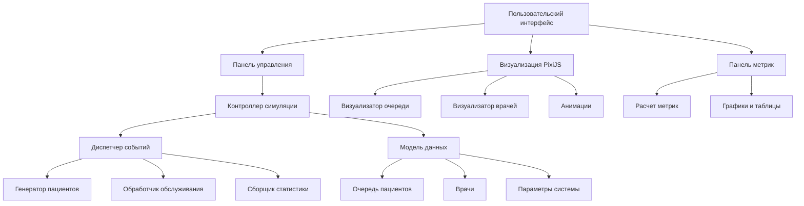

# План архитектуры симуляции очереди к врачу

## Обзор проекта
Создание интерактивной симуляции очереди к врачу с визуализацией на PixiJS для GitHub Pages.

## Архитектура системы

## Детальный план реализации

### 1. Модель данных
- **Класс Patient**: id, время прихода, время начала обслуживания, время окончания
- **Класс Doctor**: id, статус (свободен/занят), текущий пациент
- **Класс Queue**: массив пациентов, максимальная длина
- **Класс Simulation**: параметры, статистика, состояние

### 2. Дискретно-событийное ядро
- Событийная очередь с приоритетом по времени
- Типы событий: приход пациента, начало обслуживания, окончание обслуживания
- Таймлайн с возможностью ускорения/замедления

### 3. Визуализация PixiJS
- Сцена с врачебными кабинетами
- Анимированные пациенты в очереди
- Визуализация процесса обслуживания
- Индикаторы статуса врачей

### 4. Метрики производительности
- Среднее время ожидания и 95-й перцентиль
- Пропускная способность (пациентов/час)
- Загрузка врачей (% времени занятости)
- Длина очереди (текущая/максимальная)
- Количество отказов

## Параметры управления
- Интенсивность прихода: штук пациентов/час
- Среднее время приёма в минутах
- Количество врачей
- Длина очереди (максимальная)

## Функциональность
- Автоматическая симуляция с паузами/продолжением
- Визуализация в реальном времени
- Статистика в реальном времени
- Адаптивный интерфейс

## Технический стек
- HTML5/CSS3/JavaScript
- PixiJS для визуализации
- GitHub Pages для хостинга
- Дискретно-событийное моделирование
